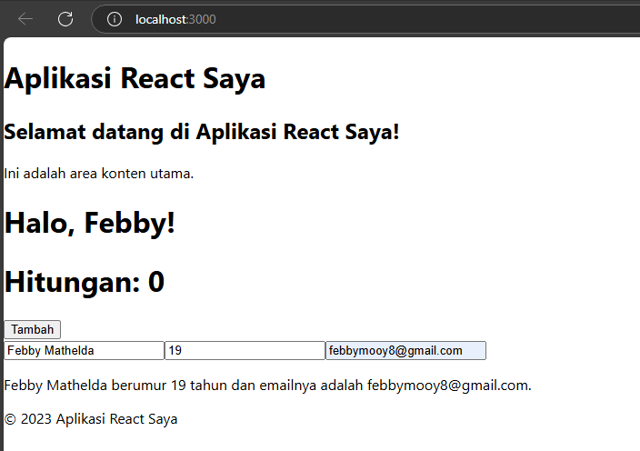

This is a [Next.js](https://nextjs.org/) project bootstrapped with [`create-next-app`](https://github.com/vercel/next.js/tree/canary/packages/create-next-app).

## Getting Started

First, run the development server:

```bash
npm run dev
# or
yarn dev
# or
pnpm dev
# or
bun dev
```

Open [http://localhost:3000](http://localhost:3000) with your browser to see the result.

You can start editing the page by modifying `app/page.tsx`. The page auto-updates as you edit the file.

This project uses [`next/font`](https://nextjs.org/docs/basic-features/font-optimization) to automatically optimize and load Inter, a custom Google Font.

## Laporan Praktikum

|  | Pemrograman Berbasis Framework 2025 |
|--|--|
| NIM |  2241720067|
| Nama |  Febby Mathelda Silvya Mooy |
| Kelas | TI - 3D |


### Praktikum 1

1.  Pastikan Node.js dan npm sudah terinstal di komputer Anda. Anda dapat memeriksanya dengan 
menjalankan perintah berikut di terminal atau command prompt:

2. Buat direktori baru untuk proyek React Anda:

3. Inisialisasi proyek React dengan menjalankan perintah berikut:


4. Jalankan aplikasi React dengan perintah: 


### Praktikum 2 Membuat Komponen React

1. Buka file src/App.js di text editor Anda. 

2. Ganti kode di dalamnya dengan kode berikut untuk membuat komponen sederhana:

Hasil:


3. Simpan file dan lihat perubahan di browser. Anda akan melihat tampilan sederhana dengan 
header, konten utama, dan footer.

Hasil pada browser:


### Praktikum 3 Menggunakan JSX untuk membuat komponen dinamis

1. Buat file baru di direktori src dengan nama Counter.js.

2. Tambahkan kode berikut untuk membuat komponen Counter yang dinamis: 


3. Buka file src/App.js dan impor komponen Counter: 


4. Tambahkan komponen Counter ke dalam komponen App: 


5. Simpan file dan lihat perubahan di browser. Anda akan melihat tombol "Tambah" yang dapat 
meningkatkan hitungan saat diklik. 

Hasil:

Sebelum mengklik tombol "Tambah"


Sesudah mengklik tombol "Tambah"


### Praktikum 4 Menggunakan Props untuk Mengirim Data

1. Buat file baru di direktori src dengan nama Greeting.js. 

2. Tambahkan kode berikut untuk membuat komponen Greeting yang menerima props: 


3. Buka file src/App.js dan impor komponen Greeting:


4. Tambahkan komponen Greeting ke dalam komponen App dan kirim props name: 


5. Simpan file dan lihat perubahan di browser. Anda akan melihat pesan "Halo, John!" yang 
ditampilkan oleh komponen Greeting.

Hasil:


### Praktikum 5 Menggunakan state untuk mengelola data

1. Buka file src/App.js dan tambahkan kode berikut untuk membuat komponen yang mengelola state: 


2. Tambahkan komponen example ke dalam komponen App:


3. Simpan file dan lihat perubahan di browser. Anda akan melihat form input yang dapat 
mengupdate state dan menampilkan data yang dimasukkan. 

Hasil:

sebelum menambah keterangan:


sesudah menambah keterangan



